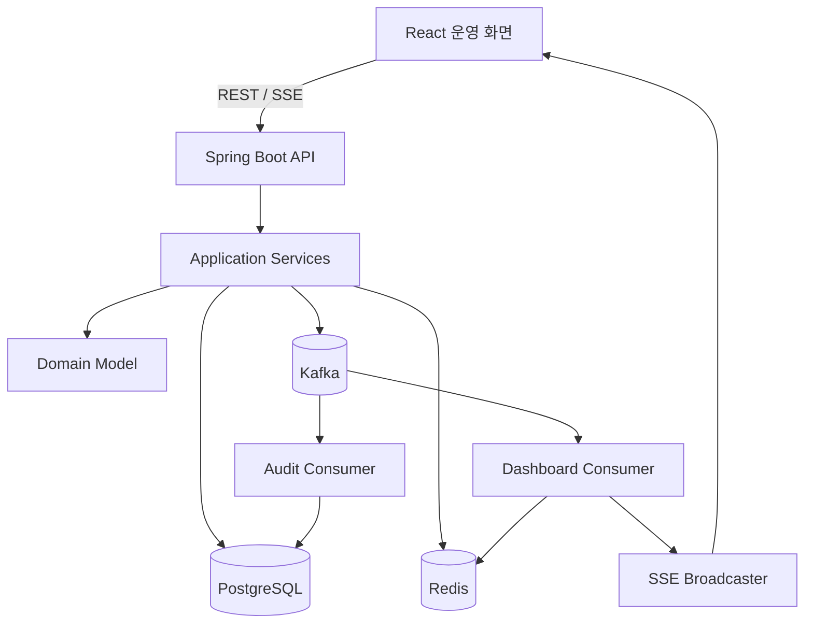

# ARCHITECTURE

## 구조

모듈형 모놀리스. 도메인별 패키지로 경계를 나누며 MSA로 분리하지 않는다.



## Backend 패키지

```text
com.logistics
├── domain
│   ├── master        # 상품, 창고·구역·위치
│   ├── vehicle       # 차량 (기준정보, 기존 패키지 유지)
│   ├── driver        # 기사 (기준정보, 기존 패키지 유지)
│   ├── inbound       # 입고·적치
│   ├── inventory     # 재고
│   ├── order         # 주문
│   ├── warehouse     # 피킹·포장 작업
│   ├── loading       # 상차, Shipment
│   ├── dispatch      # 배차
│   ├── delivery      # 배송 처리
│   ├── returns       # 반품
│   ├── audit         # 감사로그
│   └── dashboard     # 조회 전용
└── global            # common, config, error, event, sse
```

각 도메인은 `presentation`, `application`, `domain`, `infrastructure` 4개 계층으로 분리한다.

- `presentation`: Controller, DTO. 비즈니스 로직 금지.
- `application`: Service, Facade. 유스케이스 흐름 제어.
- `domain`: Entity, VO, Repository 인터페이스. 핵심 규칙과 상태 전이.
- `infrastructure`: Repository 구현, Kafka, Redis 등 기술 구현.

## 모듈 협력 규칙 (ADR-011)

- 타 도메인의 Repository 주입, Entity 직접 참조, JPA 연관(Join) 금지. ID 참조만 허용한다.
- **명령성 협력(동기)**: 타 도메인 Application Service 호출. 예: `OrderService.markPicked(orderId)`, `InventoryService.reserve(...)`. 하나의 트랜잭션에서 처리한다.
- **관찰성 협력(비동기)**: 상태 변경 이벤트를 Kafka로 발행하고 감사로그·대시보드가 소비한다.
- 주문 상태의 소유자는 `order` 도메인이며 다른 도메인은 전이 메서드를 통해서만 변경한다.

## 이벤트

- 토픽: `logistics.status-changed`
- 페이로드: `{eventId, targetType, targetId, orderId, action, fromStatus, toStatus, actor, occurredAt}`
- DB 커밋 후 발행한다. 발행 실패 가능성과 재처리 전략은 README에 한계로 기록한다(Outbox는 확장 과제).
- Consumer
  - **AuditConsumer**: `audit_log`에 기록. `processed_event`로 멱등 처리.
  - **DashboardConsumer**: 대시보드 캐시 무효화 후 SSE로 브로드캐스트.

## 동기/비동기 경계

- 동기: 명령 검증, 상태 변경, 재고 변경, 사용자 응답
- 비동기: 감사로그 기록, 대시보드 갱신
- SSE: 내부 이벤트를 브라우저에 전달하는 용도이며 영구 보관 수단이 아니다.

## SSE

- 엔드포인트 `GET /api/events/logistics` (기존 `global/sse` 재사용)
- 이벤트 이름: `status-changed`. 클라이언트는 수신 시 대시보드 요약을 재조회하고 최근 이벤트에 추가한다.
- 재연결은 브라우저 `EventSource` 기본 재연결에 맡기고, 재연결 후 요약을 다시 조회한다.

## 캐시 정책

- Key: `dashboard:summary`, `dashboard:vehicles`
- TTL: 30초(환경변수화), Cache-aside
- 상태 변경 이벤트 소비 시 관련 키 삭제
- 캐시 장애 시 PostgreSQL 조회로 기능 유지(`CacheErrorHandler`, ADR-010)

## 인증

`spring-boot-starter-security`를 포함하되 `SecurityConfig`에서 전 엔드포인트를 `permitAll`로 둔다. 사용자 식별은 `X-Actor` 헤더(없으면 `SYSTEM`)로 하며 감사로그에만 사용한다(ADR-015).

## 관측성

- 업무 식별자(orderNo, shipmentId, dispatchNo) 로그 포함
- `/actuator/health`
