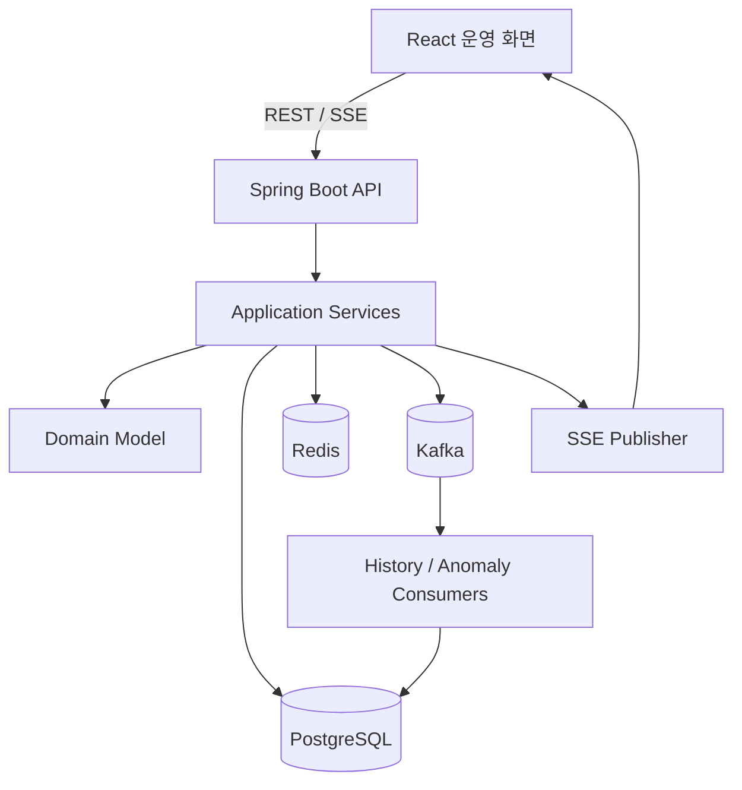

# ARCHITECTURE

## 구조

모놀리식 모듈 구조를 사용한다. 7일 안에 업무 흐름과 검증을 완성하는 것이 목적이며 MSA로 분리하지 않는다.



## Backend 패키지

```text
com.example.logistics
├── inbound
├── outbound
├── fleet
├── dispatch
├── route
├── monitoring
└── common
```

각 기능 패키지는 `presentation`, `application`, `domain`, `infrastructure` 4개 계층으로 엄격히 분리한다.

- `presentation`: Controller, Request/Response DTO. 외부 노출 계층이며 비즈니스 로직을 작성하지 않는다.
- `application`: Service, Facade. 유스케이스 흐름만 제어하고 비즈니스 로직 작성을 금지한다.
- `domain`: Entity, Value Object, Repository 인터페이스. 핵심 비즈니스 규칙과 알고리즘이 위치한다.
- `infrastructure`: Repository 구현체, Kafka, Cache, 외부 통신 기술 모듈.

기능(도메인) 간 교차 참조 시 다른 도메인의 Repository를 직접 주입하는 것을 금지하며, 오직 ID 참조 또는 이벤트 기반으로만 연동한다. 기능 간 Entity 직접 참조를 최소화하고 식별자와 Application Service로 협력한다.

## 동기/비동기 경계

- 동기: 명령 검증, 상태 변경, 사용자 응답
- 비동기: 상태 이력 투영, 이상 평가, 관제 이벤트 후속 처리
- SSE: 내부 이벤트를 브라우저에 전달하되 영구 메시지 보관 수단으로 사용하지 않는다.

## 이벤트 일관성 정책

7일 MVP에서는 DB 트랜잭션 커밋 후 이벤트를 발행한다. 발행 실패 가능성과 재처리 전략을 README에 한계로 기록한다. 시간이 허용되면 Outbox를 확장 과제로 제시하되 구현 범위에 자동 추가하지 않는다.

## 캐시 정책

- Key: `dispatch:detail:{dispatchId}`
- TTL: 60초(환경변수화)
- Cache-aside
- 배차/경로/상태 변경 성공 후 관련 키 삭제
- 캐시 장애 시 PostgreSQL 조회로 기능을 유지

## 관측성

- 요청 추적 ID
- 업무 식별자(dispatchId, outboundPlanId)
- 구조화 로그
- `/actuator/health`, readiness 점검
- k6 결과는 `docs/performance/`에 보존

